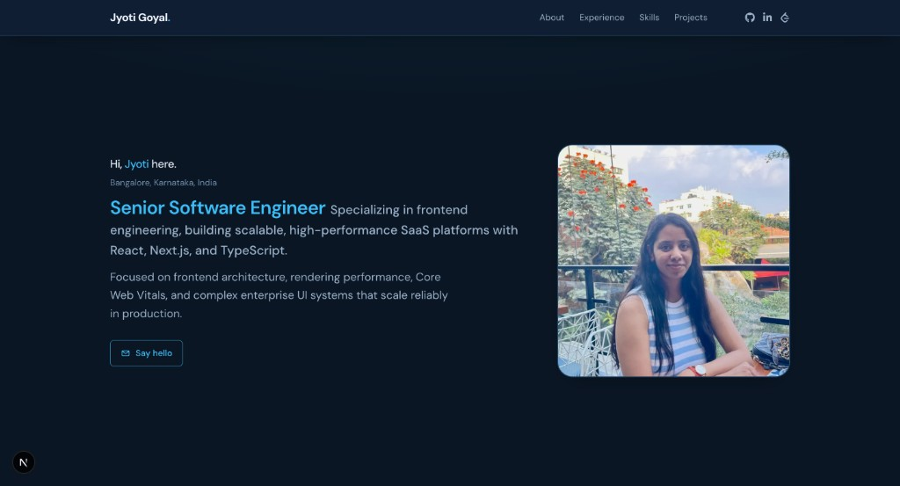

# Portfolio

Personal portfolio site built with Next.js, Tailwind CSS and Framer Motion.

## Preview



## Getting started

```bash
npm install
npm run dev
```

Open [http://localhost:3000](http://localhost:3000).

## Scripts

| Command         | Description                |
| --------------- | -------------------------- |
| `npm run dev`   | Dev server with hot reload |
| `npm run build` | Production build           |
| `npm run start` | Serve production output    |
| `npm run lint`  | ESLint                     |

## SEO helpers

- `/sitemap.xml` — see `src/app/sitemap.ts`
- `/robots.txt` — see `src/app/robots.ts`
- `/opengraph-image` — OG image generator in `src/app/opengraph-image.tsx`

## Project layout (high level)

```
src/app/           # Layout, globals, fonts, metadata, OG / robots / sitemap
src/components/
  layout/          # Header, footer
  sections/        # Page sections wired in app/page.tsx
  motion/          # FadeIn wrapper
src/lib/           # site.ts, site-url.ts
public/            # Static assets (e.g. profile.png)
```
